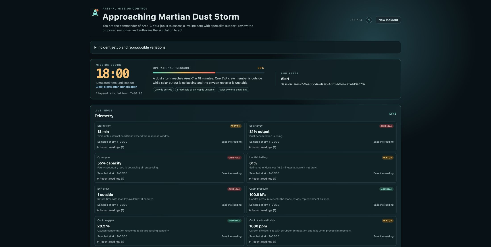
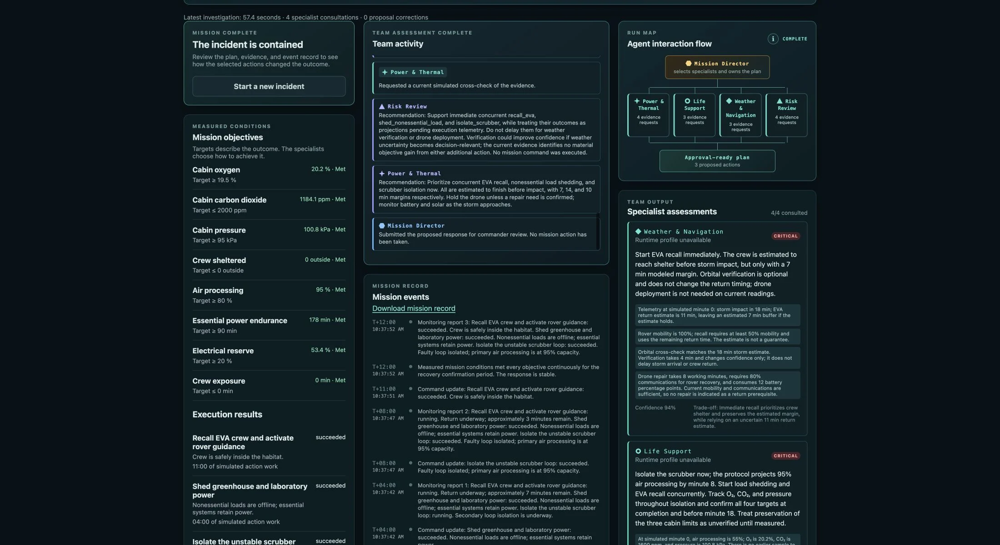
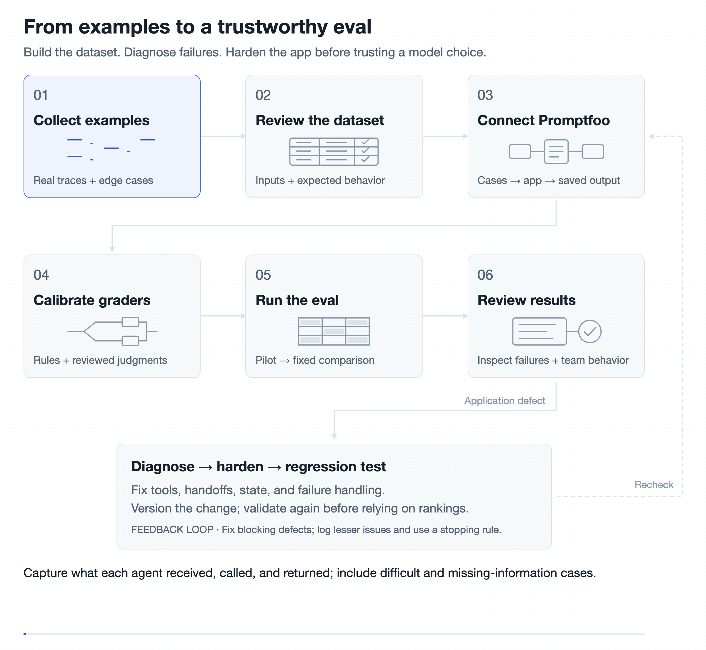

# Mars Mission Control

A five-agent mission simulator built with the [OpenAI Agents API](https://developers.openai.com/api/docs/guides/agents-api/overview), React, and TypeScript. A Mission Director coordinates Power & Thermal, Life Support, Weather & Navigation, and Risk Review specialists. The agents inspect simulated mission evidence and propose actions for human approval.

Read the accompanying post: [How to Set Up Evals for a Complex Multi-Agent System](https://blog.latentthoughts.com/how-to-set-up-evals-for-a-complex-multi-agent-system).





## Project layout

```text
.
├── src/                 React UI, mission controls, and API client
│   └── components/      Mission dashboard and agent interaction views
├── server/              HTTP API, agent coordination, simulator, and tracing
├── evals/               Offline regression tests and simulator checks
│   ├── browser/         Playwright UI tests
│   └── promptfoo/       Agent eval harness, graders, and calibration tools
├── public/              Static assets served by the app
├── .github/workflows/   Automated validation in GitHub Actions
├── .env.example         Environment settings and agent model profiles
└── package.json         Dependencies and app, test, and eval commands
```

## Run the app

Requires Node.js 22, npm, and an OpenAI API key with access to the Agents API and the configured models.

```sh
npm ci
cp .env.example .env.local
```

Set `OPENAI_API_KEY` in `.env.local`, then start the development servers:

```sh
npm run dev
```

Open [localhost:5173](http://localhost:5173). The backend runs on port 3001. Starting a mission assessment makes paid API calls; starting the app alone does not.

The default profiles use GPT-6 Luna at medium reasoning for the Director, Life Support, and Weather & Navigation, and GPT-6 Astra at medium for Power & Thermal and Risk Review. See [.env.example](.env.example) for model overrides, execution limits, and access settings. These are provisional engineering choices, not evidence of production reliability.

To build and serve the app locally:

```sh
npm run build
npm start
```

Open [localhost:3001](http://localhost:3001). Keep `.env.local` private; it is excluded from Git.

## Optional Phoenix tracing

[Arize Phoenix](https://arize.com/docs/phoenix) is optional. With a Docker engine running, start a local Phoenix server with persistent storage:

```sh
docker run -d --name phoenix \
  -p 127.0.0.1:6006:6006 \
  -e PHOENIX_WORKING_DIR=/mnt/data \
  -v phoenix_data:/mnt/data \
  arizephoenix/phoenix:latest
```

Update `.env.local` and restart the app:

```dotenv
PHOENIX_ENABLED=true
PHOENIX_PROJECT_NAME=mars-mission-control
PHOENIX_COLLECTOR_ENDPOINT=http://localhost:6006
```

Open [localhost:6006](http://localhost:6006) after an assessment to inspect application spans for Director work, specialist consultations, tool calls, and authorization resumption. These spans capture timing and status metadata, not full prompts, responses, or the hosted model's internal execution.

Use `docker stop phoenix` and `docker start phoenix` for subsequent sessions. Set `PHOENIX_ENABLED=false` to disable tracing.

## Tests and evals



The following checks run offline without an API key:

```sh
npm run check
npm run check:evals
npm test
npm run test:security
npm run eval
```

`npm run eval` checks simulator behavior. The [Promptfoo](https://www.promptfoo.dev/docs/intro/) harness in [evals/promptfoo](evals/promptfoo) evaluates agent episodes using custom JavaScript checks and an LLM rubric judge.

This code-only distribution excludes recorded runs, reviewed datasets, reference answers, calibration labels, and saved results. Before running the Promptfoo comparison:

1. Supply `evals/promptfoo/dataset.json` and its reviewed case files using the types in [dataset.ts](evals/promptfoo/dataset.ts). Include source evidence, required findings, acceptable actions, and grading criteria. Optional reference answers must use the harness's reference-bundle format.
2. Restore the supporting review and history artifacts, or adapt the dataset-building and verification scripts to your new dataset. Calibration, regrading, reporting, and some `test:evals` tests also depend on excluded artifacts; they are not ready to run from this copy alone. Recording fresh missions with `eval:collect` requires a committed Git checkout and makes paid calls when invoked with `--live`.
3. Review [promptfooconfig.ts](evals/promptfoo/promptfooconfig.ts), the grading policy, model access, and budget limits. The base comparison is Luna at low, medium, and high reasoning; it does not automatically use the app's five selected profiles. With the dataset in place, `npm run eval:plan` previews the comparison without model calls.
4. When ready to authorize a paid comparison, set `execution-policy.json` to `status: "released"` with `allowedOperations: ["candidate", "judge"]` and a reason. Then run `npm run eval:models -- --live`. Return the policy to `on_hold` afterward.

Candidate and judge calls both incur API charges. The supplied comparison policy starts on hold. Review other live collection and validation scripts separately before invoking them.

## License

[MIT](LICENSE).
